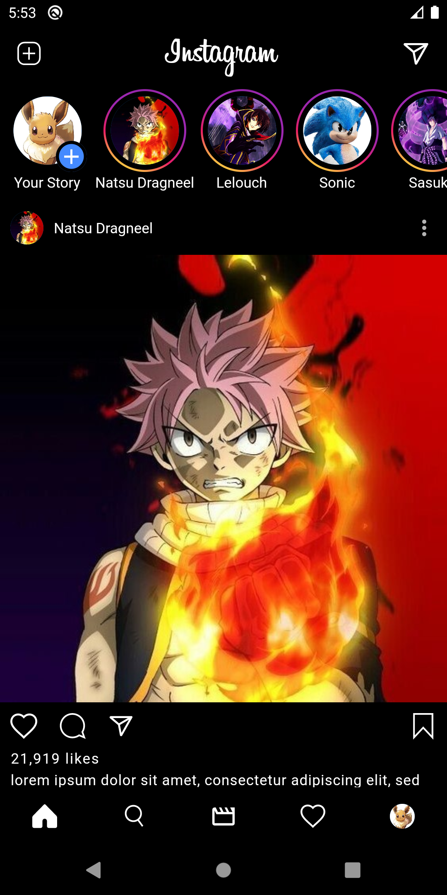

# Clone Apps
Cloning an existing application is the best way to learn anything. So I learn flutter just by making clone apps for WhatsApp, Instagram, etc, and also make some small projects on my own.

[ Instragram ](https://github.com/AbhilashTUofficial/Instagram-Clone-Flutter)\
[ Google ClassRoom ](https://github.com/AbhilashTUofficial/GoogleClassRoom-Clone-Flutter)\
[ WhatsApp ](https://github.com/AbhilashTUofficial/WhatsApp-Clone-Flutter)
 

|Screen 1|Screen 2|Screen 3|
|---|---|---|
||||
||||
||||
 

### Languages & tools :
[][dart]
[][flutter]
[][flutter]
  

### Directory Structure :

    |-- Icon
    |    |-- androidstudio.png
    |    |-- dart.png
    |    |-- flutter.png
    |
    |-- Img
    |    |-- GoogleClassroom1.png
    |    |-- GoogleClassroom2.png
    |    |-- GoogleClassroom3.png
    |    |-- GoogleClassroom4.png
    |    |-- Instagram1.png
    |    |-- Instagram2.png
    |    |-- Instagram3.png
    |    |-- Instagram4.png
    |    |-- WhatsApp1.png
    |    |-- WhatsApp2.png
    |    |-- WhatsApp3.png
    |    |-- WhatsApp4.png
    |
    |-- googleclassroom_clone
    |
    |-- whatsapp_clone
    |
    |-- youtube_clone
    |
    |-- README.md

 

### Connect with me :  

  
 

[website]: https://abhilashtuofficial.github.io/
[instagram]: https://www.instagram.com/abhilash_tu/
[dart]: https://github.com/AbhilashTUofficial/CloneApps
[flutter]: https://github.com/AbhilashTUofficial/CloneApps

